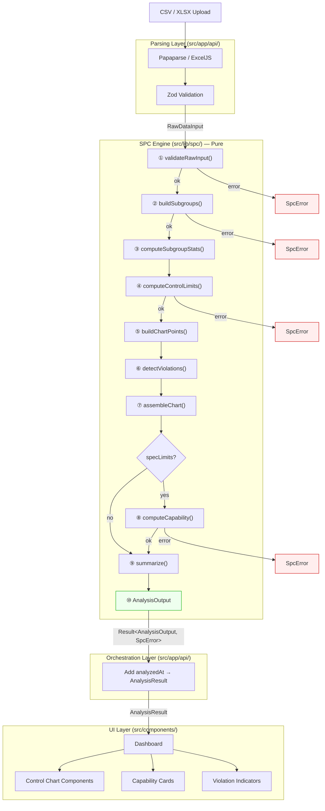
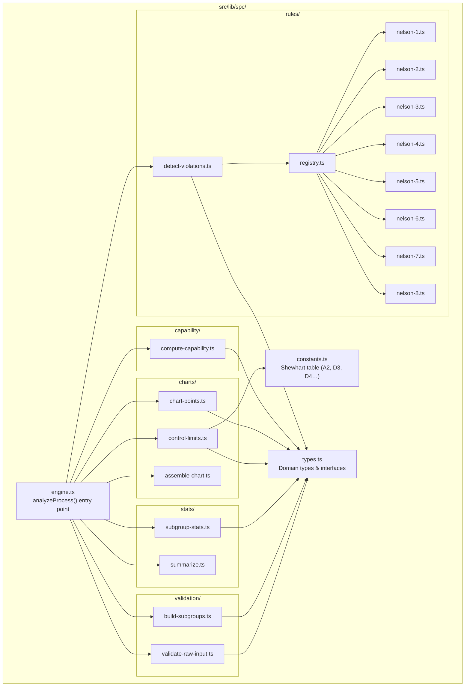

# Devio — Architecture

> Authoritative architecture document for Devio, a Statistical Process Control (SPC) analysis tool.
> This file is referenced by `AGENTS.md` and lives in `docs/ARCHITECTURE.md`.

## 1. System Overview

Devio is a stateless Next.js 15 application that lets manufacturing and quality engineers upload process measurement data and receive:

- **Control charts** (X̄-R, X̄-S, I-MR) with annotated out-of-control points
- **Nelson rule violation detection** (all 8 rules)
- **Process capability indices** (Cp, Cpk, Pp, Ppk)
- **AI-generated DMAIC reports** via Claude

The core statistical engine is a **pure TypeScript library** (`src/lib/spc/`) with zero framework dependencies. It runs server-side as part of Next.js API routes and React Server Components. The UI is a React 19 dashboard rendered with Recharts and Tailwind CSS v4.

### Key Architectural Principles

| Principle | How It's Enforced |
|---|---|
| **Purity** | All functions in `src/lib/spc/` are pure: no I/O, no side effects, deterministic output for identical input. |
| **Result-based error handling** | No thrown exceptions in the engine. All fallible operations return `Result<T, SpcError>`. |
| **Immutability** | Every domain type uses `readonly` fields and `readonly` arrays. |
| **Invalid states are unrepresentable** | Discriminated unions prevent impossible combinations (e.g., Cp without bilateral spec limits). |
| **Single source of truth for types** | All domain types live in `src/lib/spc/types.ts`. No duplication. |

## 2. Data Flow

The complete pipeline from raw user input to rendered dashboard:



### Pipeline Properties

- **Fail-fast**: Each step returns `Result`. On error, the pipeline short-circuits immediately.
- **Pure**: Zero I/O inside the engine. The orchestration layer adds `analyzedAt: new Date()`.
- **Testable in isolation**: Each function is independently importable and unit-testable.
- **Single entry point**: Consumers call `analyzeProcess(data, options)`. Internal functions are not exported from `src/lib/spc/`.

## 3. Module Structure



### Module Responsibilities

| Module | Path | Responsibility |
|---|---|---|
| **types** | `types.ts` | All domain types. Single source of truth. No runtime code except `ALL_NELSON_RULE_IDS`. |
| **constants** | `constants.ts` | Shewhart constants table (n=2–25). `ShewhartConstants` interface, `getShewhartConstants()` lookup, `E2` precomputed constant. |
| **engine** | `engine.ts` | Public entry point `analyzeProcess()`. Orchestrates pipeline steps 1–10. Only export from `src/lib/spc/`. |
| **validate-raw-input** | `validation/validate-raw-input.ts` | Validates `RawDataInput`: finite values, non-empty arrays, timestamp/label length matching, chart type compatibility. |
| **build-subgroups** | `validation/build-subgroups.ts` | Converts validated input into `Subgroup[]`. Groups flat data by `n`, validates subgroup size consistency. |
| **subgroup-stats** | `stats/subgroup-stats.ts` | Computes per-subgroup statistics: means, ranges, std devs, individuals, moving ranges. Also computes `processMean`, `sigmaWithin`, `sigmaOverall`. |
| **summarize** | `stats/summarize.ts` | Builds `DatasetSummary` and `ViolationSummary` from computed data. |
| **control-limits** | `charts/control-limits.ts` | Calculates `ControlLimits` for primary and secondary charts using Shewhart constants. |
| **chart-points** | `charts/chart-points.ts` | Builds `ChartPoint[]` from subgroup statistics for the appropriate chart type. |
| **assemble-chart** | `charts/assemble-chart.ts` | Combines limits, points, violations, and labels into a `ControlChart`. |
| **detect-violations** | `rules/detect-violations.ts` | Runs active Nelson rules against chart points. Filters rules by `options.nelsonRules`. |
| **registry** | `rules/registry.ts` | `NELSON_RULES: readonly ViolationRule[]` — the array of all 8 rule definitions. |
| **nelson-{1–8}** | `rules/nelson-{1..8}.ts` | One file per rule. Each exports a `ViolationRule` with metadata and `detect()` function. |
| **compute-capability** | `capability/compute-capability.ts` | Computes Cp, Cpk, Pp, Ppk from spec limits, process mean, σ_within, and σ_overall. |

## 4. Domain Type Map

```
                         ┌─────────────────────────────────┐
                         │       analyzeProcess()          │
                         │  Result<AnalysisOutput, SpcError>│
                         └──────────┬──────────────────────┘
                                    │
               ┌────────────────────┼─────────────────────┐
               │                    │                      │
          SpcError            AnalysisOutput               │
        (7 variants)               │                       │
                    ┌──────────────┼──────────────┐        │
                    │              │               │        │
             DatasetSummary   ControlChart   ProcessCapability
                               │      │        │        │
                          primary  secondary    cp    cpk ...
                          (SingleChart)       (CapabilityIndex)
                            │       │
                      ControlLimits  ChartPoint[]
                            │
                      Violation[]
                            │
                      NelsonRuleId

  Inputs:
    Measurement → Subgroup[] → ChartType → SpecificationLimits?

  Orchestration layer adds:
    AnalysisOutput + analyzedAt → AnalysisResult (for UI)
```  

## 5. Design Decisions

### DR-1: AnalysisOutput vs AnalysisResult (pure vs enriched)

**Decision**: The engine returns `AnalysisOutput` (pure, no runtime metadata). The orchestration layer enriches it into `AnalysisResult` by adding `analyzedAt: Date`.

**Alternatives considered**:
- *Engine returns `AnalysisResult` with `new Date()` inside*: Violates AGENTS.md purity rule ("deterministic output for identical input"). Breaks snapshot testing and caching.

**Rationale**: The engine must be 100% pure. Runtime metadata is the responsibility of the impure orchestration layer. Cost: one extra type and a spread operator. Benefit: real purity, not purity-with-asterisk.

### DR-2: Violations separated from ChartPoint

**Decision**: `ChartPoint` has only `subgroupIndex` and `value`. Violations live as a flat array in `SingleChart.violations`, linked to points via `triggerIndex`.

**Alternatives considered**:
- *Embed `violations: Violation[]` inside each `ChartPoint`*: Requires rebuilding all points after violation detection (step 6b `embedViolations()`). Makes toggling Nelson rules in the UI expensive (must reconstruct all points). Creates 1000+ object copies for large datasets.

**Rationale**: Separated violations simplify the pipeline (no rebuild step), enable cheap UI toggles (filter one array), and reduce object allocation. The UI builds a `Map.groupBy(violations, v => v.triggerIndex)` once in `useMemo`.

### DR-3: RawDataInput as discriminated union (not function overloads)

**Decision**: `RawDataInput` uses `kind: "flat" | "grouped"` discriminant.

**Alternatives considered**:
- *Two function overloads*: `analyzeProcess(data: number[], ...)` and `analyzeProcess(data: number[][], ...)`. More ergonomic for simple cases, but `timestamps` and `labels` metadata needs a home — adding them as 3rd/4th parameters is worse API than an object.

**Rationale**: The discriminant eliminates ambiguity (empty arrays are unambiguous). Metadata fields (`timestamps`, `labels`) fit naturally in the object. Will revisit if the CSV parser produces a shape that makes overloads more natural.

### DR-4: Shewhart constants as Record<SubgroupSize, T> (not Map or array)

**Decision**: `SHEWHART_CONSTANTS` is a `Readonly<Record<SubgroupSize, ShewhartConstants>>` where `SubgroupSize` is a literal union `2 | 3 | ... | 25`.

**Alternatives considered**:
- *`Map<number, ShewhartConstants>`*: Not JSON-serializable. Verbose `.get(5)!` syntax.
- *`ShewhartConstants[]` (array)*: Index 0 and 1 are wasted. `constants[999]` compiles without error.
- *Open `Record<number, ...>`*: No compile-time rejection of untabulated sizes.

**Rationale**: The literal union restricts keys at compile time. `getShewhartConstants(n)` provides the safe runtime lookup returning `| undefined`.

### DR-5: NelsonRuleId as string literal union (not enum)

**Decision**: `NelsonRuleId = "nelson-1" | "nelson-2" | ... | "nelson-8"`.

**Alternatives considered**:
- *`enum NelsonRuleId { Rule1 = "nelson-1", ... }`*: Generates runtime JavaScript code. Doesn't compose as cleanly with discriminated unions. No practical benefit over string literals in TypeScript.

**Rationale**: String literal unions are idiomatic TypeScript. Zero runtime cost. Full IDE autocomplete. The "nelson-" prefix namespaces them for future extension (e.g., "weco-1" for Western Electric rules in v2).

### DR-6: Capability as discriminated union (bilateral vs unilateral)

**Decision**: `ProcessCapability` is a discriminated union with `kind: "bilateral"` (has `cp`, `cpk`, `pp`, `ppk`) and `kind: "unilateral"` (has only `cpk`, `ppk`).

**Alternatives considered**:
- *Single interface with `cp?: CapabilityIndex`*: Allows accessing `cp` without null-check on unilateral results. The formula `Cp = (USL - LSL) / 6σ` is undefined with a single spec limit — the field shouldn't exist, not be `undefined`.

**Rationale**: Makes invalid states unrepresentable. TypeScript enforces that `cp` is only accessed when bilateral spec limits are present.

## 6. SPC Glossary

Terms used consistently across codebase, UI copy, and documentation.

| Abbreviation | Full Name | Description | Reference |
|---|---|---|---|
| **CL** | Center Line | Process mean on the control chart | Montgomery §6.2 |
| **UCL** | Upper Control Limit | CL + 3σ̂ (statistical, derived from variation) | Montgomery §6.2 |
| **LCL** | Lower Control Limit | CL − 3σ̂ (statistical, derived from variation) | Montgomery §6.2 |
| **USL** | Upper Specification Limit | Upper engineering requirement | Montgomery §7.2 |
| **LSL** | Lower Specification Limit | Lower engineering requirement | Montgomery §7.2 |
| **Cp** | Process Capability | (USL − LSL) / 6σ̂_within — potential, short-term | Montgomery §7.2 |
| **Cpk** | Process Capability Index | min((USL − μ̂), (μ̂ − LSL)) / 3σ̂_within — actual, short-term | Montgomery §7.2 |
| **Pp** | Process Performance | (USL − LSL) / 6σ̂_overall — potential, long-term | Montgomery §7.3 |
| **Ppk** | Process Performance Index | min((USL − μ̂), (μ̂ − LSL)) / 3σ̂_overall — actual, long-term | Montgomery §7.3 |
| **σ̂_within** | Within-subgroup sigma | R̄/d2 (range-based) or S̄/c4 (std-dev-based) | Montgomery §6.2 |
| **σ̂_overall** | Overall sigma | √(Σ(xᵢ − x̄̄)² / (N−1)) — total process variation | Montgomery §7.3 |
| **A2, D3, D4** | X̄-R chart constants | Shewhart factors for control limits using ranges | Montgomery App. Table VI |
| **A3, B3, B4** | X̄-S chart constants | Shewhart factors for control limits using std dev | Montgomery App. Table VI |
| **c4, d2, d3** | Unbiasing constants | Correct estimates of σ from S̄ and R̄ | Montgomery App. Table VI |
| **E2** | I-MR chart constant | 3/d2 at n=2, for individual chart limits | Montgomery §6.4 |
| **Nelson Rules 1–8** | Out-of-control tests | 8 pattern-based rules for detecting special causes | Nelson, JQT 16(4), 1984 |

### Bibliographic References

1. Montgomery, D.C. *Introduction to Statistical Quality Control*, 8th ed., Wiley, 2020.
2. Nelson, L.S. "The Shewhart Control Chart — Tests for Special Causes", *Journal of Quality Technology*, 16(4), 1984, pp. 237–239.
3. AIAG. *Statistical Process Control (SPC) Reference Manual*, 2nd ed., Automotive Industry Action Group, 2005.
4. Grant, E.L. & Leavenworth, R.S. *Statistical Quality Control*, 7th ed., McGraw-Hill, 1996.
5. Wheeler, D.J. *Understanding Variation: The Key to Managing Chaos*, SPC Press, 2000.
